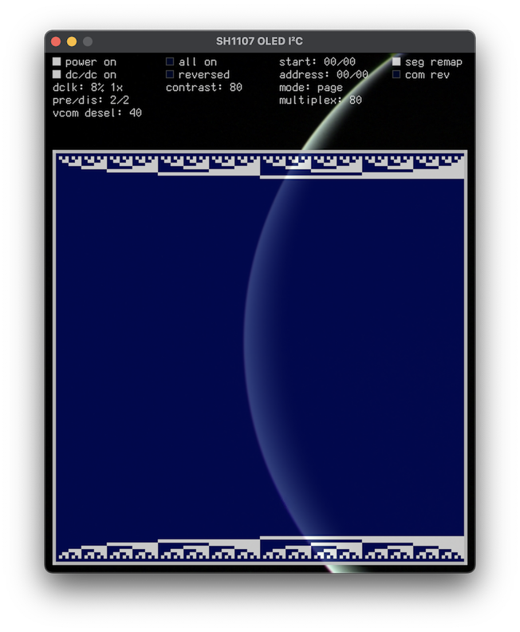

# oled_i2c

[](https://buildkite.com/daintree/oled-i2c)

Chawwo!

We're just learning to write gateware. This repository is a testbed for exploring [Amaranth](https://github.com/amaranth-lang/amaranth) while doing so. It contains an I²C controller, plus (currently very basic) driver for SH1107-type OLEDs over I²C, such as the [Pimoroni 1.12" 128x128 monochrome OLED](https://shop.pimoroni.com/products/1-12-oled-breakout). There's a driver in the root which exposes the various things it can do:

```console
$ ./driver.py -h
usage: driver [-h] {test,formal,build,rom,vsh} ...

positional arguments:
  {test,formal,build,rom,vsh}
    test                run the unit tests and sim tests
    formal              formally verify the design
    build               build the design, and optionally program it
    rom                 build the ROM image, and optionally program it
    vsh                 run the Virtual SH1107

options:
  -h, --help            show this help message and exit
```

(The formal verification is a TODO. We're just beginning to work on putting the ROM contents in SPI flash instead and reading it from there.)

The current test deployment target is the iCEBreaker ([Crowd Supply](https://www.crowdsupply.com/1bitsquared/icebreaker-fpga), [1BitSquared](https://1bitsquared.com/products/icebreaker)). Connect PMOD1 A1 to SDA, A2 to SCL.

Maybe the most interesting thing right now is the Virtual SH1107 for testing the simulation:

[](doc/vsh.png)

Initially this was implemented in Python and ran cooperatively with Amaranth's own simulator, like the unit tests, but it was pretty slow. It's now written in [Zig](https://ziglang.org), and interacts directly with the simulated hardware by compiling it to C++ through Yosys's [CXXRTL backend](https://github.com/YosysHQ/yosys/tree/master/backends/cxxrtl).

It responds to the gateware at the signal level (albeit quite permissively), providing a decent high-level overview of what's going on.
