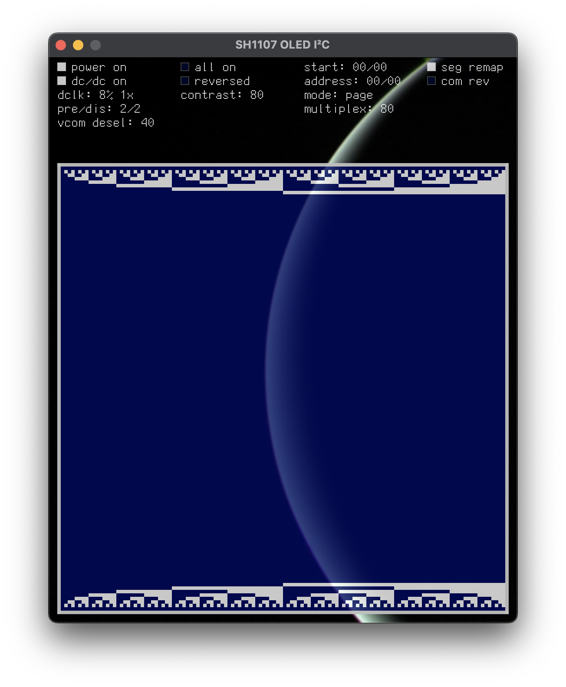
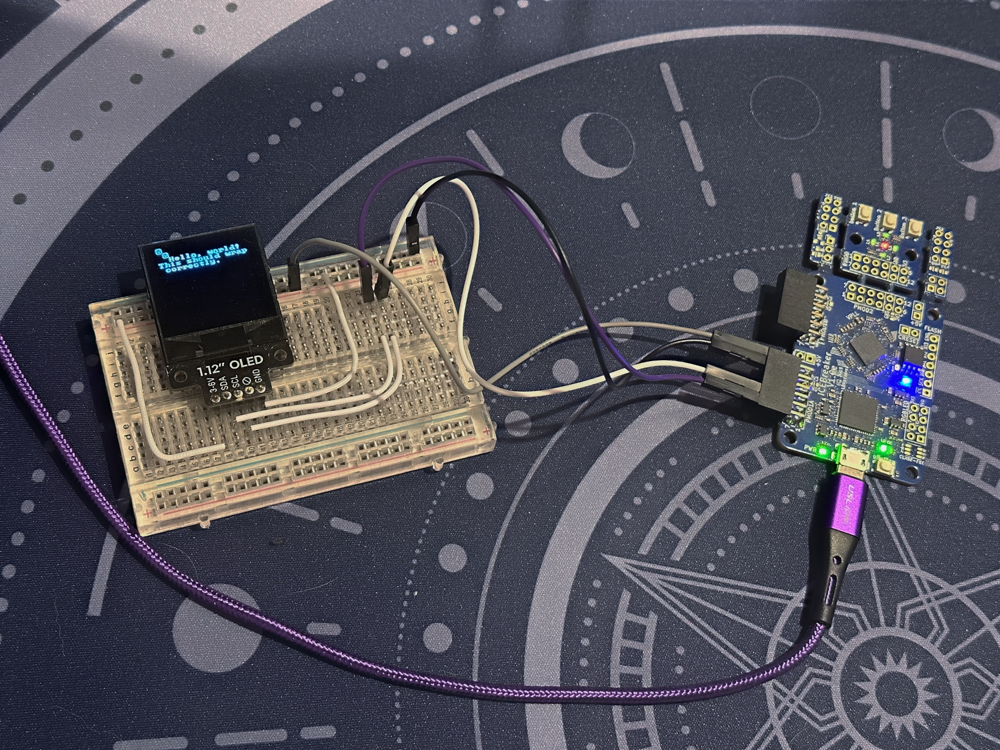

# sh1107

[](https://buildkite.com/hrzn/sh1107)

Hiy! I'm just learning to write gateware. This repository is a testbed for
exploring [Amaranth](https://github.com/amaranth-lang/amaranth) while doing so.
It contains a read/write I²C controller, plus a basic driver for SH1107-type
OLEDs over I²C, such as the [Pimoroni 1.12" 128x128 monochrome
OLED](https://shop.pimoroni.com/products/1-12-oled-breakout). The driver
supports simple commands akin to old BASIC: `CLS`, `PRINT`, `LOCATE`. The
classic IBM 8x8 font is used to this end.

There's an entry-point in the root which exposes the various things it can do:

```console
$ ./main.py -h
usage: main [-h] {test,formal,build,rom,vsh} ...

positional arguments:
  {test,formal,build,rom,vsh}
    test                run the unit tests and sim tests
    formal              formally verify the design
    build               build the design, and optionally program it
    rom                 build the ROM image, and optionally program it
    vsh                 run the Virtual SH1107

options:
  -h, --help            show this help message and exit
```

The current test deployment targets are:

* iCEBreaker ([Crowd
  Supply](https://www.crowdsupply.com/1bitsquared/icebreaker-fpga),
  [1BitSquared](https://1bitsquared.com/products/icebreaker)).
  * Connect PMOD1 A1 to SDA, A2 to SCL.
* OrangeCrab ([1BitSquared](https://1bitsquared.com/products/orangecrab)).
  * Connect the pins named SDA and SCL.
  * The code currently expects you have rev 0.2 with an 85F like I do. It's
    trivial to add support for rev 0.1 and/or the 25F.

## TODOs

- OrangeCrab: try on-board DDR3 instead of EBR.
- pack 16-bit data for 16-bit wide memories.
- try QSPI.

## vsh

Maybe the most interesting thing right now is the Virtual SH1107 for testing the
gateware. It emulates the internal state of the SH1107 device — what you see
rendered is what you should see on the display.

[](doc/vsh.png) [](doc/helloworld.jpg)

Initially this was implemented in Python and ran cooperatively with Amaranth's
own simulator, like the unit tests, but it was pretty slow. It's now written in
[Zig](https://ziglang.org), and interacts with the simulated hardware running on
its own thread by compiling it to C++ through Yosys's [CXXRTL
backend](https://github.com/YosysHQ/yosys/tree/master/backends/cxxrtl).

```console
$ ./main.py vsh -h
usage: main vsh [-h] [-i] [-f] [-c] [-s {100000,400000,2000000}] [-t TOP]
                [-v] [-O {none,rtl,zig,both}]

options:
  -h, --help            show this help message and exit
  -i, --whitebox-i2c    simulate the full I2C protocol; by default it is
                        replaced with a blackbox for speed
  -f, --whitebox-spifr  simulate the full SPI protocol for the flash reader;
                        by default it is replaced with a blackbox for speed
  -c, --compile         compile only; don't run
  -s {100000,400000,2000000}, --speed {100000,400000,2000000}
                        I2C bus speed to build at
  -t TOP, --top TOP     which top-level module to simulate (default:
                        oled.Top)
  -v, --vcd             output a VCD file
  -O {none,rtl,zig,both}, --optimize {none,rtl,zig,both}
                        build RTL or Zig with optimizations (default: both)
```

### I²C

By default, the I²C circuit is stubbed out with a
[blackbox](vsh/i2c_blackbox.cc) that acts close enough to the real controller
for the rest of the design, and the Virtual SH1107
[spies](vsh/src/I2CBBConnector.zig) on the inputs to the blackbox directly. This
is fast.

At the most fine-grained level (`vsh -i`), it responds to the gateware by doing
edge detection at I²C level, [spying](vsh/src/I2CConnector.zig) on the I²C
lines. This method is faster than the pure Python version I started with, but
still slow enough to take several seconds to clear the screen when not compiled
with optimizations.

### SPI flash

Sequences of SH1107 commands used by the driver are packed into a ROM image
which is separately programmed onto the on-board flash.  The driver reads the
contents into RAM on startup over SPI.

By default, the SPI flash reader component is stubbed out with a
[blackbox](vsh/spifr_blackbox.cc), which emulates the component's
[interface](vsh/spifr_blackbox.il), returning data bytes directly to the OLED
driver from the ROM embedded in the build.

This blackbox can be replaced with a [whitebox](vsh/spifr_whitebox.cc), which
emulates at one level lower, emulating the [SPI
interface](vsh/spifr_whitebox.il) itself, returning data bitwise to the [flash
reader](spi/spi_flash_reader.py).
